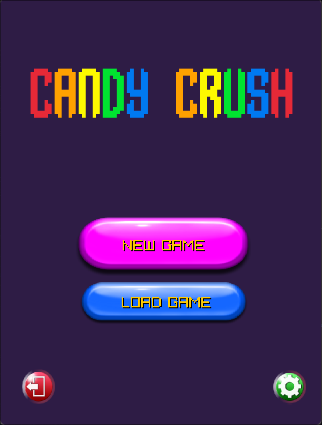
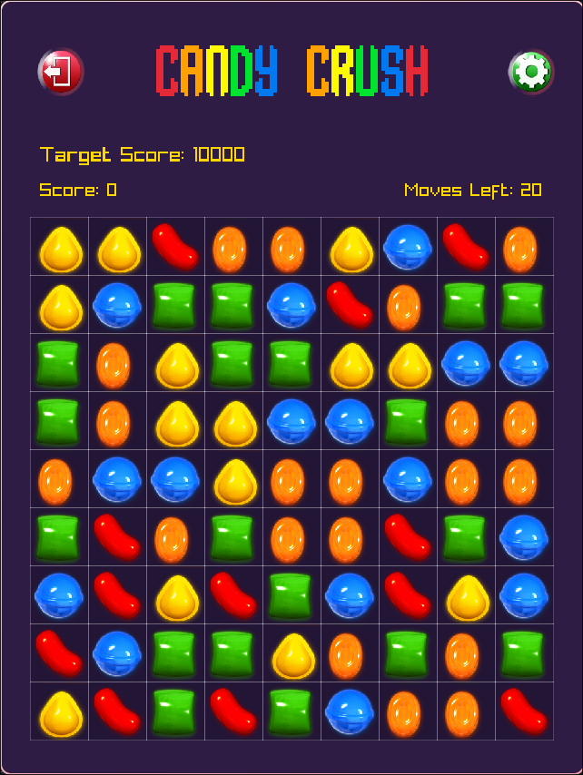

# Candy Crush Clone (Rubber Duckies PF Project)

A C++ implementation of the classic match-3 puzzle game "Candy Crush", built using the Raylib library. This project was developed as a Programming Fundamentals project

## Features

- **Classic Match-3 Gameplay:** Swap adjacent candies to create matches of 3 or more.
- **Game Loop:**
  - **Moves Limit:** You have a limited number of moves (20) to reach the target score.
  - **Scoring:** Earn points for every match.
  - **Win/Lose Conditions:** Win by reaching the target score before running out of moves.
- **Game States:**
  - Main Menu
  - Settings (Audio controls)
  - Instructions Page
  - In-Game
  - Win/Lose Screens
- **Audio:** Background music and sound effects.
- **Persistence:** Save and load game progress.

## Screenshots





## Prerequisites

To build and run this project, you need:

- **C++ Compiler:** A compiler that supports C++17 (e.g., `g++`).
- **Raylib:** The Raylib library must be installed on your system.


## Building the Project

You can build the project using the provided shell script or via VS Code tasks.

### Using the Terminal

1.  Open a terminal in the project root directory.
2.  Run the build script:
    ```bash
    ./.vscode/build.sh src build
    ```
    This will compile the source code and copy the assets to the `build` directory.

### Using VS Code

1.  Open the project in VS Code.
2.  Press `Ctrl+Shift+B` (or `Cmd+Shift+B` on macOS) to run the default build task.

## Running the Game

After building, the executable will be located in the `build` directory.

```bash
./build/pf_project
```

## Controls

- **Mouse:** Use the mouse cursor to navigate menus and interact with the game grid.
- **Left Click:**
  - Click on a candy to select it.
  - Click on an adjacent candy to swap them.
  - Click on buttons in the UI to navigate.

## Project Structure

- `src/`: Source code files.
  - `main.cpp`: Entry point of the application.
  - `game/`: Game logic and state management.
  - `grid/`: Board representation and matching logic.
  - `input/`: Input handling (mouse).
  - `frontend/`: Rendering and UI components.
  - `audio/`: Audio management.
  - `db/`: File handling for saving/loading.
- `assets/`: Game assets (fonts, music, textures, styles).
- `build/`: Compiled executable and runtime assets.

## Authors

- **Rubber Duckies Team**
